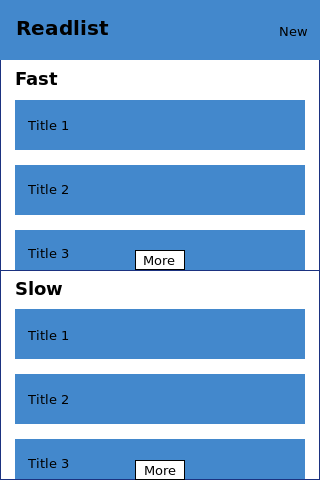
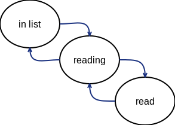

# Features

The list of features, ordered by importance that will be implemented. Some of the features will have accompanying
[stories](stories.md) to better clarify what is expected.

- [ ] add element to ordered list - [story](stories.md#add-item)
- [ ] sort elements in the list
- [ ] [mark element as read](#mark-as-read)
- [ ] [mark element as reading](#mark-as-reading)
- [ ] add metadata to elements, like: title, URL, position
- [ ] two separate lists of elements, one for fast and one for slow materials
- [ ] move elements from one list to the other
- [ ] sync with Pocket - [story](stories.md#add-item-from-pocket)
- [ ] sync with Trello
- [ ] [archive](#archive)

__Legend__

- [ ] is going to be implemented
- [X] is being implemented
- [X] ~~implemented~~

## Mockups

### Home page

## Features details

Detailed explanation of the features that are not straightforward.

### Mark as read

When an item is marked as read it should go to the bottom of the list.

When an item is unmarked as read it should go to the top of the list.

### Mark as reading

When an item is marked as reading it should go to the top of the list.

When an item is unmarked as reading it should go under the last item in reading.

The state machine should behave like the following picture

### Archive

The last five elements in a list are the read items. All the items can be seen in an archive section.
